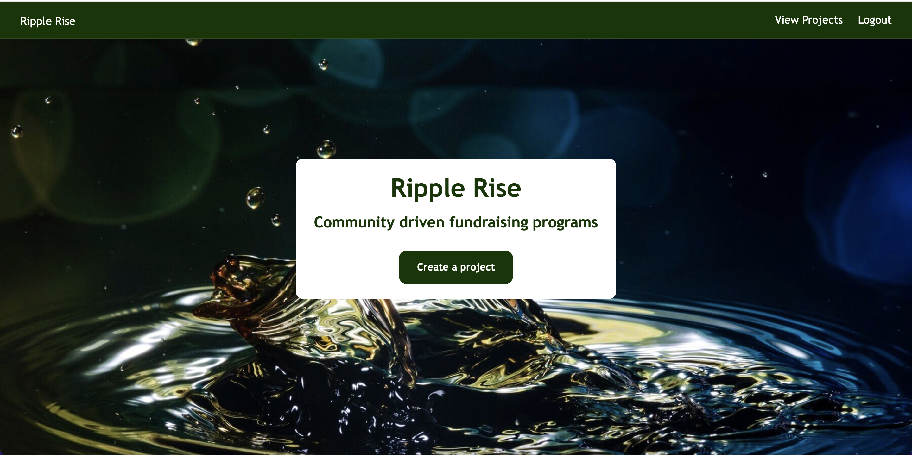
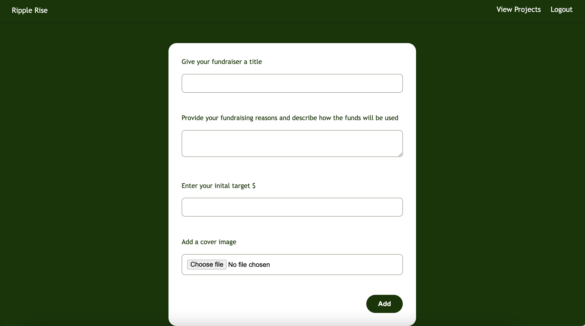
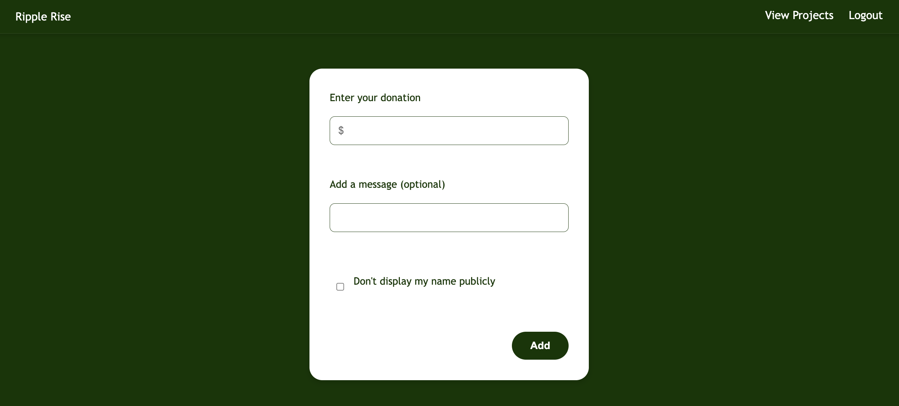
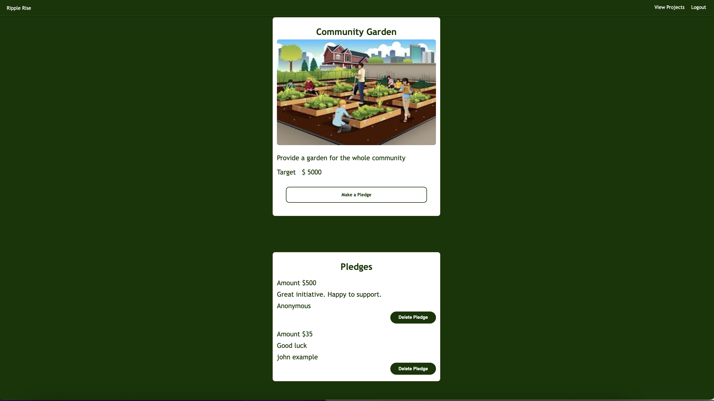

# Crowdfunding Front End

Creator: Lisa Todesco 
Deployed Location: https://moonlit-stroopwafel-09d7b2.netlify.app/

## Planning:

### Concept/Name

__RippleRise__

Community driven microgrants program. 
This platform focuses on funding small, local community projects and initiatives through microgrants. Instead of large fundraising goals, projects would request small amounts for targeted initiatives like community gardens, local art installations, or neighbourhood improvement projects.

### Intended Audience

Organised by local communities or neighbourhoods. 
Allows residents to propose and fund projects that directly impact their community.
Also encourages local artists to get involved and provide their skills to various projects. 
Partner with local businesses, foundations, and government agencies such as local councils.

### User Stories

- As a Community Member, I want to easily submit project proposals for funding, so I can share my idea with potential backers.
- As a Project Creator, I want to set a funding goal and timeline for my project, so I can clearly communicate my needs to supporters.
- As a Donor/Backer, I want to make pledges of varying amounts, so I can support projects that I am interested in.
- As a User, I want to manage my profile - currently only available via insomnia.
- As a User, I want to update my projects and pledges - currently only available via insomnia.

### Front End Pages/Functionality

- HomePage / Ripple Rise
  - A user can login 
  - A user can sign up
  - A user can view projects
- View Projects
  - A user can view all projects
- Login
  - A user can login
- Logout
  - If a user is logged in then they will see the logout button and can logout
- Create a Project
  - If a user is logged in then they can create new projects
- Add a Pledge / Delete a Pledge
  - If a user is logged in and viewing a project, then they can create a pledge for that project
  - If a user is logged in and viewing a project, then they can delete a pledge if they are the user that created the pledge
- Sign up
    - A user can sign up and it will automatically log then in once done
    - Then a user can create projects and add pledges to projects
 

### API Spec

| URL                   | HTTP Method | Purpose                                   | Request Body                                                                                                                                      | Success Response Code | Authentication/Authorisation                           |
| --------------------- | ----------- | ----------------------------------------- | ------------------------------------------------------------------------------------------------------------------------------------------------- | --------------------- | ------------------------------------------------------ |
| /pledges/             | GET         | Returns all the pledges                   | N/A                                                                                                                                               | 200                   | None                                                   |
| `/pledges/<init pk>`  | GET         | Returns the details of a specific pledge  | N/A                                                                                                                                               | 200                   | None                                                   |
| /projects/            | GET         | Returns all the projects                  | N/A                                                                                                                                               | 200                   | None                                                   |
| `/projects/<init pk>` | GET         | Returns the details of a specific project | N/A                                                                                                                                               | 200                   | None                                                   |
| /users/               | GET         | Returns all the users                     | N/A                                                                                                                                               | 200                   | Must be logged in                                      |
| `/users/<init pk>`    | GET         | Returns the details of a specific user    | N/A                                                                                                                                               | 200                   | Must be logged in                                      |
| /api-token-auth/      | POST        | Returns a user token                      | {"username": "\_**\_", "password": "\_\_\_**"}                                                                                                    | 200                   | Supply the correct username and password               |
| /projects/            | POST        | Create a new project                      | {"title": "Project 7", "description": "The seventh project.", "goal": 300, "image": "**\_\_\_**.jpg", "is_open": true}                            | 201                   | Must be logged in                                      |
| /pledges/             | POST        | Create a new pledge                       | { "amount": 58, "comment": "Love this project!", "anonymous": false, "project": 6}                                                                | 201                   | Must be logged in                                      |
| /users/               | POST        | Creae a new user                          | {"username": "jexample2", "first_name": "jill", "last_name": "example", "email": "`example@gmail.com`", "password": "**\_**", "is_staff": false}  | 201                   | None                                                   |
| `/projects/<init pk>` | PUT         | Modify the details for a specific project | "title": "Project 4", "description": "The 4th project" "goal": 300, "image": "**\_**.jpg", "is_open": true,                                       | 200                   | Must be logged in as the user that created the project |
| `/pledges/<init pk>`  | PUT         | Modify the details for a specific pledge  | {"amount": 20, "comment": "Love this project!", "anonymous": false}                                                                               | 200                   | Must be logged in as the user that created the pledge  |
| `/pledges/<init pk>` | DELETE | Delete a pledge | N/A | 204 | Must be logged in as the user that created the pledge|
| `/projects/<init pk>`| DELETE | Delete a project | N/A | 204 | Must be logged in as the user that created the project |
| `/users/<init pk>`    | PUT         | Modify the details for a specific user    | {"username": "jexample3", "first_name": "three", "last_name": "example", "email": "`example@gmail.com`", "password": "**\_**", "is_staff": false} | 200                   | Must be the same user that is logged in                |

## Project Requirements

Your crowdfunding project must:

- [x] Be separated into two distinct projects: an API built using the Django Rest Framework and a website built using React.
- [x] Have a cool name, bonus points if it includes a pun and/or missing vowels. 
- [x] Have a clear target audience.
- [x] Have user accounts. A user should have at least the following attributes:
  - [x] Username
  - [x] Email address
  - [x] Password
- [x] Ability to create a “project” to be crowdfunded which will include at least the following attributes:
  - [x] Title
  - [x] Owner (a user)
  - [x] Description
  - [x] Image - implemented ability to upload own images and host them from aws
  - [x] Target amount to fundraise
  - [x] Whether it is currently open to accepting new supporters or not
  - [x] When the project was created
- [x] Ability to “pledge” to a project. A pledge should include at least the following attributes:
  - [x] An amount
  - [x] The project the pledge is for
  - [x] The supporter/user (i.e. who created the pledge)
  - [x] Whether the pledge is anonymous or not
  - [x] A comment to go along with the pledge
- [x] Implement suitable update/delete functionality - user can delete a pledge;
- [x] Implement suitable permissions, e.g. who is allowed to delete a pledge? - a custom additional permission
- [x] Return the relevant status codes for both successful and unsuccessful requests to the API.
- [x] Handle failed requests gracefully (e.g. you should have a custom 404 page rather than the default error page).
- [x] Use Token Authentication
- [x] Implement responsive design.

## Additional Notes

Check off each item when done:
- [x] A link to the deployed project
- https://moonlit-stroopwafel-09d7b2.netlify.app/
- [x] A screenshot of the homepage
  
- [x] A screenshot of the project creation form
  
- [x] A screenshot of the pledge add form
  
- [x] A screenshot of a project with pledges
  